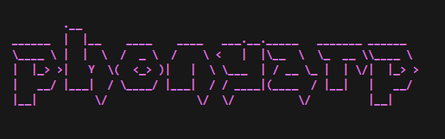
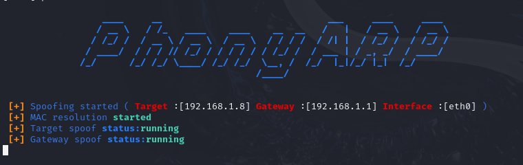
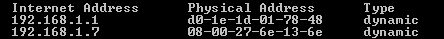

</img>

# PhonyARP 

PhonyARP is a python tool which is used for ARP spoofing or ARP poisoning which is developed by [**PkTheHacker10**](https://github.com/PkTheHacker10) .  

## Packages used :-

- sys
- threading
- scrapy
- requests
- argparser
- colorama
- time
# Attention :- 
This ARP spoofing tool is strictly for ethical and educational purposes only. It is intended to help users understand network security concepts and identify vulnerabilities in their systems. Unauthorized use of this tool on networks without explicit permission is illegal and unethical. Always ensure compliance with applicable laws and obtain consent before testing.

## Installation :-

This is a tool which will use network interface to send Poisoned ARP packets in the network so it **need superuser permission** to do this.

### Step 1:
Clone the repo into your system. 

    git clone https://github.com/PkTheHacker10/phonyARP.git

### Step 2:
Switch into the tool directory . 

    cd phonyARP

### Step 3:
Install this tool in system wide to access this tool .

    sudo python3 setup.py install 

This will install the tool in your system.

## Features :-

- User friendly and colourfull UI
- Robust Error Handling
- Threading to run simultaneous tasks


## Usage :-


</img>


```
[DESCRIPTION]: PhonyArp is a tool which is purely meant for ARPSpoofing by PkTheHacker10.

    [Usage]:phonyARP -i <interface> -t <target> -g <gateway>

            phonyarp [flags]

    [flags]
                
            [input]
            
                -i,   --interface               :  interface is used to send spoofed arp packets. [mandatory]  
                -t,   --target                  :  target ip to spoof the arp table.              [mandatory]
                -g,   --gateway                 :  gatway ip to imprisonate to the target.        [mandatory]
                    
            [debug]
                   
                -v,   --version                 :  to check version of this tool. 
                -h,   --help                    :  to see all the available options.
```
## Sample output :-
Here is the sample arp spoofing simulation.
### Network setup:
Before Arp spoofing :
</img>

After Arp spoofing :
</img>

From the above images you can see that the gateway's MAC address is replaced by attacker's MAC address in victim's ARP cache and as well as victim's MAC is spoofed with attacker's mac on the router's ARP cache too.
Now the victim's network traffic will sent through attacker device . 

Note :-
- You and the victim should be in the same network.
- Should enable Ip forward to avoid intruption in network.

